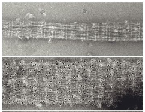
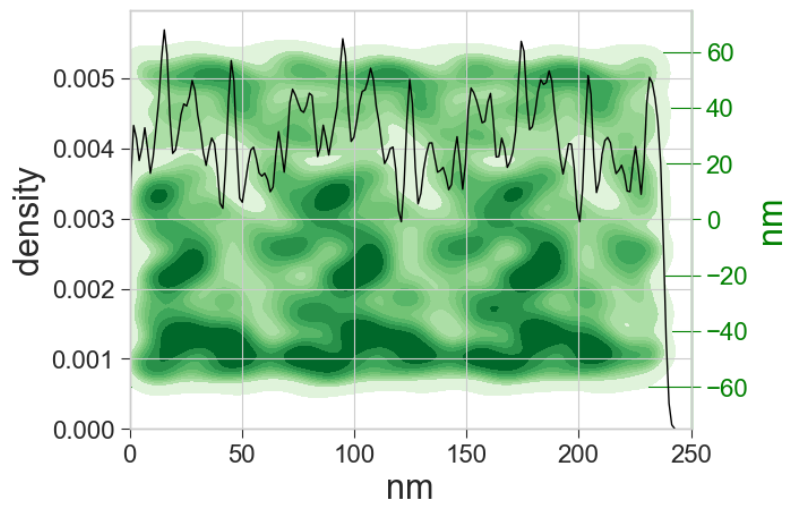

# Analysis of immunoEM decoration along a fibre

This project was started to analyse epitope distribution along fibres with regularly repeating features, specifically by using immuno-gold labeling. An example of our data before and after immuno-gold labeling:

The output is a histogram that shows the distribution per three repeating units of the fibre, as well as a heatmap that includes lateral distribution of gold per three repeats:

## About the scripts

### Files required:

**0001_bin4_results.csv observation coordinates file** csv file containing the coordinates of all gold beads of a single fibre (fibre 0001). This is obtained using the golddigger imageJ plugin as described in the "Data preparation" section. 

**0001_bin4_coordinates.csv fibre centre coordinates file** csv file containing the coordinates of a line drawn along the center of a fibre. This is manually drawn in imageJ. A line can also be generated through the center of gold observations. However, in our case with variable decoration, a manually drawn line was more accurate. The line was drawn from a feature that was kept consistent between all fibres (in our case one type of the cross striations). The lines are drawn following the same polarity each time.

**repeat, measured repeat length in the bin4 images (in pixels)** Measured by tracing 10 striations and divided by 10 for a more accurate number. This number was consistent for all fibres.

**striation, measured repeat length in nanometers** This was deducted from the fourier transform of the fibres in imageJ, and known pixel size at the electron microscope magnification.

### Preparation of scripts

The script was written for the analysis of multiple images of fibres. In the example we only provide the csv files for one image. To enable the script on multiple fibres, change the script as follows:

**remove temporary file names**
hash out file_name and angle_name under **temporary** in code block 1. Add in the hashed out file_name and angle_name just below it.

hash out the lines under **temporary for only a single file** in code block 2. Add in the hashed out loop just above it under **loop through the files in the folder**

The images we used were 1024*1024 pixels. This needs to be adjusted to your data in code block 1.

### About the scripts

block 1 orients the data from polarized fibres.

block 2 rotates the gold bead coordinates to be centered around the X-axis. This was done because our fibres were mostly oriented diagonally in the images.

block 3 collapses the Y-axis so the lateral offset of gold beads on the fibre is neglected.

block 4 collapses the data to get the cumulative measurements displayed on a single repeat.

Block 5 collapses the data for the cumlative measurements on three repeats. This was done to overcome artifacts seen at the edges of the histogram.

Block 6 plots the histogram as well as a heat map that shows the lateral distribution of gold beads per three striations.

### Future improvements
- measurement of the striation repeats and the center of the filaments can be automated.
- Picking of the gold beads using golddigger can be further automated using alternative software.